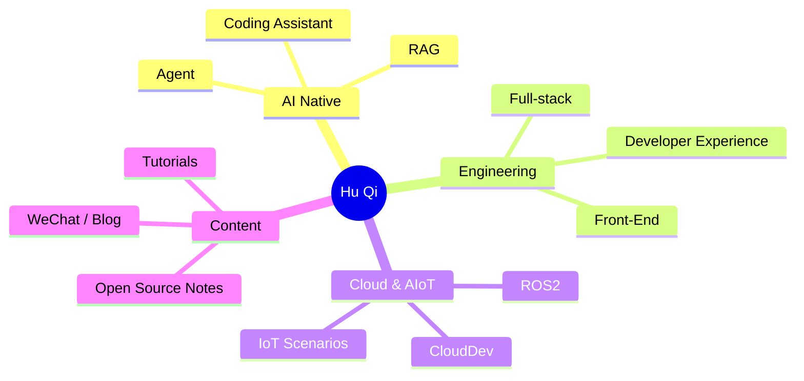
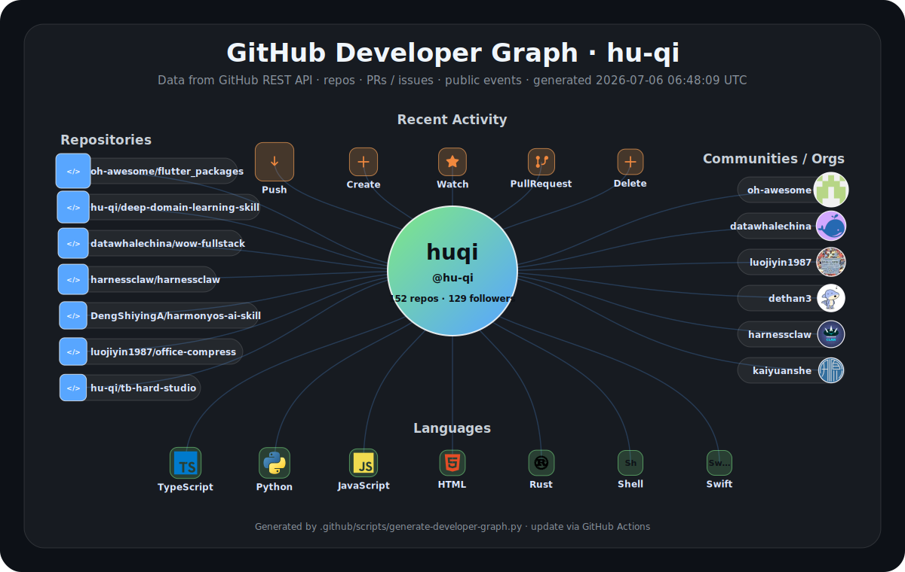
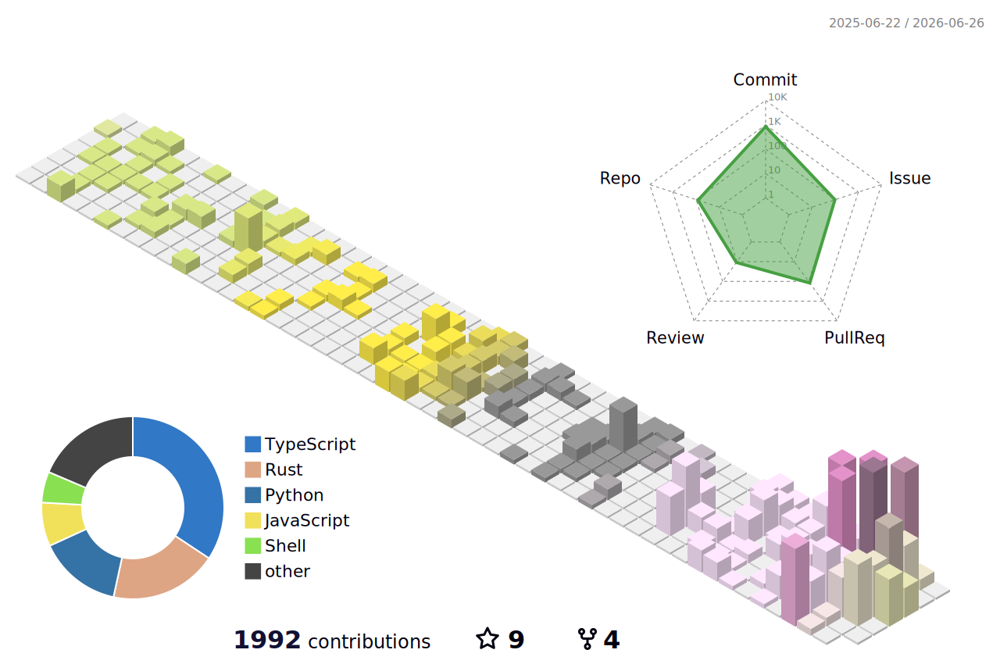

<!--
  hu-qi/hu-qi is a special repository: this README appears on the GitHub profile.
  Design goal: fewer fragile external dependencies, more native GitHub interactivity.
-->

<div align="center">

# Hi, I'm Hu Qi 👋

### AI-native builder · Front-End engineer · Cloud & AIoT explorer

<p>
  <a href="https://github.com/hu-qi"></a>
  <a href="mailto:huqi1024@gmail.com"></a>
  <a href="https://hu-qi.github.io"></a>
</p>

<p>
  I build practical AI applications, developer tools, technical tutorials, and cloud-native demos.
  <br />
  Recently focused on <b>AI Agent</b>, <b>RAG</b>, <b>Full-stack engineering</b>, <b>ROS2</b>, and <b>CloudDev</b>.
</p>

</div>

---

## 🚀 What I am building

<table>
<tr>
<td width="50%" valign="top">

### 🤖 AI / Agent / RAG

- [wow-agent](https://github.com/datawhalechina/wow-agent) — learning and building agent workflows
- [wow-rag](https://github.com/datawhalechina/wow-rag) — retrieval-augmented generation practice
- AI coding, prompt engineering, knowledge-base applications

</td>
<td width="50%" valign="top">

### 🧩 Full-stack / Cloud / AIoT

- [wow-fullstack](https://github.com/datawhalechina/wow-fullstack) — full-stack project practice
- Front-End engineering, interactive docs, developer experience
- ROS2, IoT scenarios, cloud-native hands-on cases

</td>
</tr>
</table>


```mermaid
mindmap
  root((Hu Qi))
    AI Native
      Agent
      RAG
      Coding Assistant
    Engineering
      Front-End
      Full-stack
      Developer Experience
    Cloud & AIoT
      CloudDev
      ROS2
      IoT Scenarios
    Content
      Tutorials
      Open Source Notes
      WeChat / Blog
```

---

## 🕸️ GitHub developer graph

<div align="center">



</div>

<details>
<summary><b>How this graph is generated</b></summary>

<br />

This graph is generated from GitHub data and updated by GitHub Actions.

| Signal | Meaning |
| --- | --- |
| Repositories | Own repos ranked by stars, forks, and recent activity |
| Communities / Orgs | External repositories and organizations touched by authored issues, PRs, or public events |
| Languages | Language distribution from public repositories |
| Activity Types | Recent public GitHub event types |

The generator lives in `.github/scripts/generate-developer-graph.py`, and the workflow lives in `.github/workflows/update-developer-graph.yml`.

</details>

---

## 🧭 Explore my profile

<details open>
<summary><b>🌟 Current focus</b></summary>

<br />

| Direction | What I care about | Output style |
| --- | --- | --- |
| AI Agent | from toy demos to useful workflows | repos, tutorials, cases |
| RAG | retrieval quality, knowledge engineering, evaluation | notes, examples, templates |
| Front-End | interaction, visual polish, DX | components, pages, docs |
| CloudDev | practical cloud scenarios | hands-on guides, case studies |
| AIoT / ROS2 | bridging software and devices | experiments, demos |

</details>

<details>
<summary><b>🛠️ Tech stack and tools</b></summary>

<br />

<p>
  
</p>

```txt
Languages     TypeScript / JavaScript / Python / Markdown
Front-End     React / Vue / Vite / Interactive Docs
AI            Agent / RAG / Prompt Engineering / AI Coding
Cloud & IoT   CloudDev / Linux / Docker / ROS2 / AIoT
Workflow      GitHub / VS Code / Technical Writing / Open Source
```

</details>

<details>
<summary><b>📚 Writing and communities</b></summary>

<br />

| Platform | Link |
| --- | --- |
| Blog | [hu-qi.github.io](https://hu-qi.github.io) |
| X / Twitter | [@huqii](https://twitter.com/huqii) |
| 知乎 | [fashaoge](https://www.zhihu.com/people/fashaoge) |
| 华为云社区 | [Hu Qi on Huawei Cloud](https://bbs.huaweicloud.com/community/usersnew/id_1567662212449451) |

</details>

<details>
<summary><b>💬 Contact / WeChat</b></summary>

<br />

<table>
<tr>
<td width="55%" valign="top">

- Email: [huqi1024@gmail.com](mailto:huqi1024@gmail.com)
- GitHub: [@hu-qi](https://github.com/hu-qi)
- Open to collaboration on AI applications, Front-End, CloudDev, AIoT, tutorials, and open-source learning projects.

</td>
<td width="45%" align="center">


</td>
</tr>
</table>

</details>

---

## 📊 GitHub signal

<div align="center">

<picture>
  <source media="(prefers-color-scheme: dark)" srcset="https://github-readme-stats.vercel.app/api?username=hu-qi&show_icons=true&theme=dark&hide_border=true&bg_color=00000000&rank_icon=github" />
  <source media="(prefers-color-scheme: light)" srcset="https://github-readme-stats.vercel.app/api?username=hu-qi&show_icons=true&hide_border=true&bg_color=00000000&rank_icon=github" />
  
</picture>

<picture>
  <source media="(prefers-color-scheme: dark)" srcset="https://github-readme-stats.vercel.app/api/top-langs/?username=hu-qi&layout=compact&theme=dark&hide_border=true&bg_color=00000000" />
  <source media="(prefers-color-scheme: light)" srcset="https://github-readme-stats.vercel.app/api/top-langs/?username=hu-qi&layout=compact&hide_border=true&bg_color=00000000" />
  
</picture>

</div>

<details>
<summary><b>🏆 More GitHub widgets</b></summary>

<br />

<div align="center">


<br /><br />



</div>

</details>

---

## 🧪 README design notes

This profile README intentionally uses mostly native GitHub-flavored Markdown features:

- `details / summary` for clickable sections
- `picture` for light/dark adaptive GitHub stats
- `mermaid` for an interactive-looking knowledge map without custom JavaScript
- generated SVG developer relationship graph from GitHub data
- fewer fragile external widgets; removed abandoned-style counters and skill-chart dependencies

<div align="center">

### Thanks for visiting. Let's build useful things with AI. ✨

</div>
