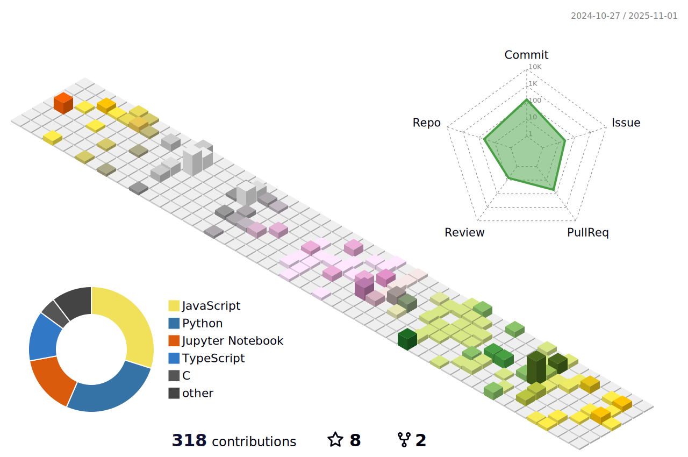

<!---
hu-qi/hu-qi is a ✨ special ✨ repository because its `README.md` (this file) appears on your GitHub profile.
You can click the Preview link to take a look at your changes.
--->

<a align="center" href="https://github.com/hu-qi">
  
  
  

   
  
  - 👋 Hi, I’m @hu-qi
  - 👀 I’m looking for a job
  - 🌱 I’m currently learning HarmonyOS、Ascend and Astro
  - 💞️ I’m looking to collaborate on Front-End, AIoT
  - 📫 How to reach me: huqi1024@gmail.com
</a>

 

More...

  
   
  

## 访问量： 

